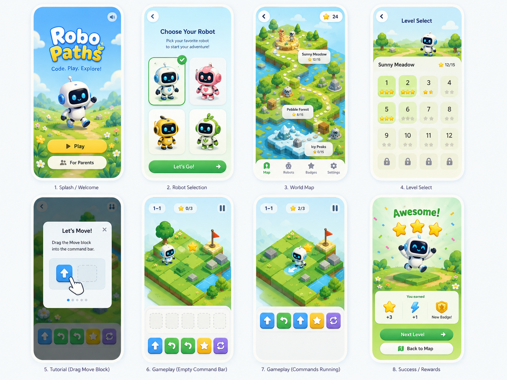
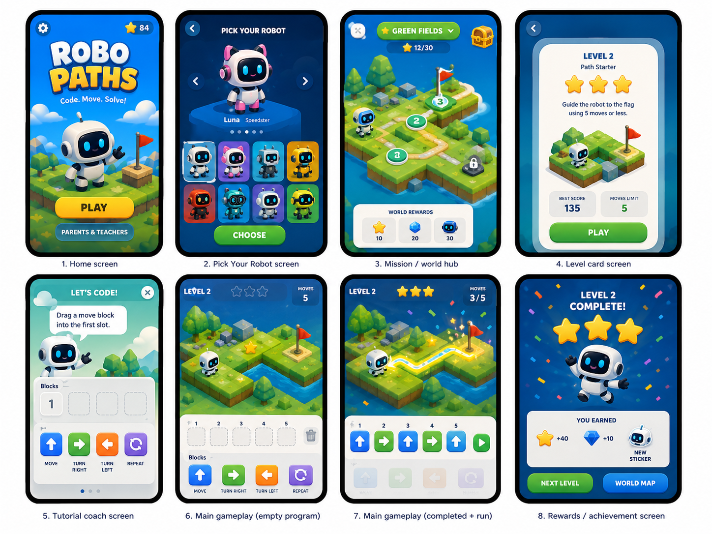
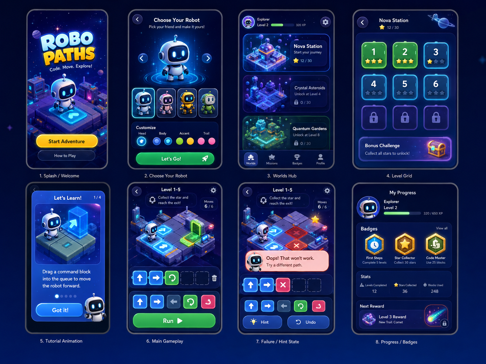
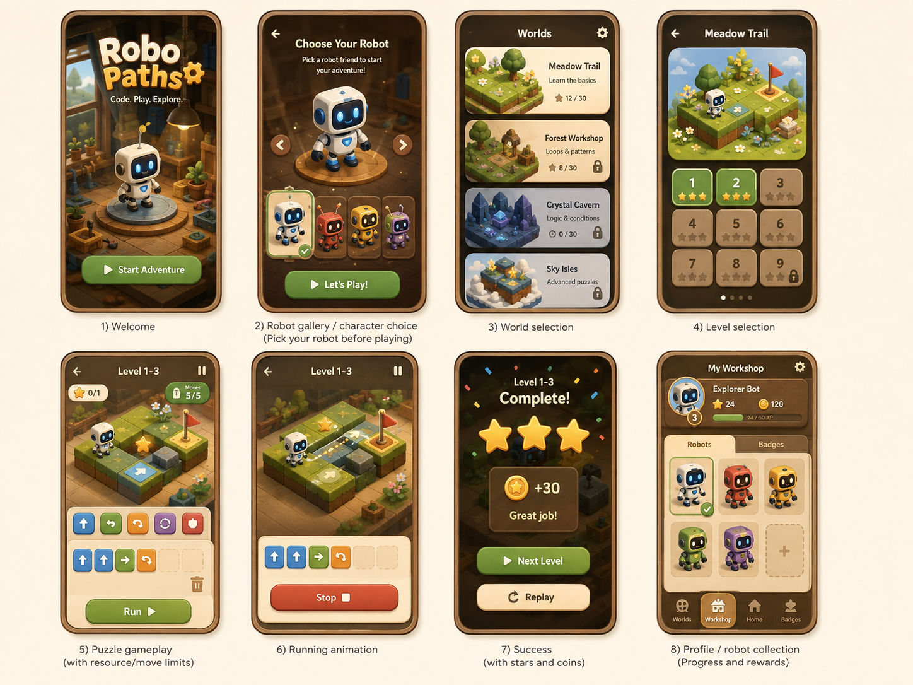
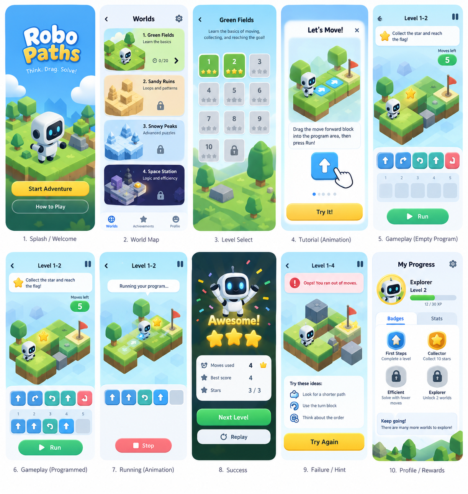

# Design references

Open [the local gallery](index.html) in a browser. It uses only files in this folder; it is a reference viewer, **not a playable prototype**. Full-resolution boards are preserved as provided, with eight Bright Meadow screen excerpts for easier inspection.

The user requested selectable robots but did not approve a single final art direction. **Bright Meadow is the proposed working default.** Use the written [UI/UX specification](../docs/ui-ux.md) and [design/asset brief](../docs/design-system-and-assets.md) as the implementation authority for interactions and semantics.

## Supplied boards

### Bright Meadow

Proposed working default; four starter robots and an airy mobile game flow.

### Bold Blue

Alternative with bolder contrast and a larger robot gallery. Currency/ability labels are not v1 requirements.

### Neon Space

Alternative dark space direction, including a useful retry-state reference.

### Cozy Workshop

Alternative warm wooden workshop direction; coins/XP are not v1 mechanics.

### Original flow study

Earlier ten-screen exploration with tutorial, editing, playback, success, retry and rewards.

## What is and is not included

Included: concept PNGs, eight reference crops, a local gallery, provenance metadata and a written production-asset brief. Not included: independent production sprite sheets, rigged robot models, final sound effects, a Figma source file or font binaries. New responsive, offline, update and semantic-board states are specified in text and still need implementation screenshots.

Do not reproduce the concept boards’ inconsistent moves counters, sideways-turn arrows, coin/gem/XP systems, robot power names or exact sample level numbers. They are visual exploration, not approved mechanics. All four starter robots have identical abilities, and written v1 ratings/limits control the implementation.
